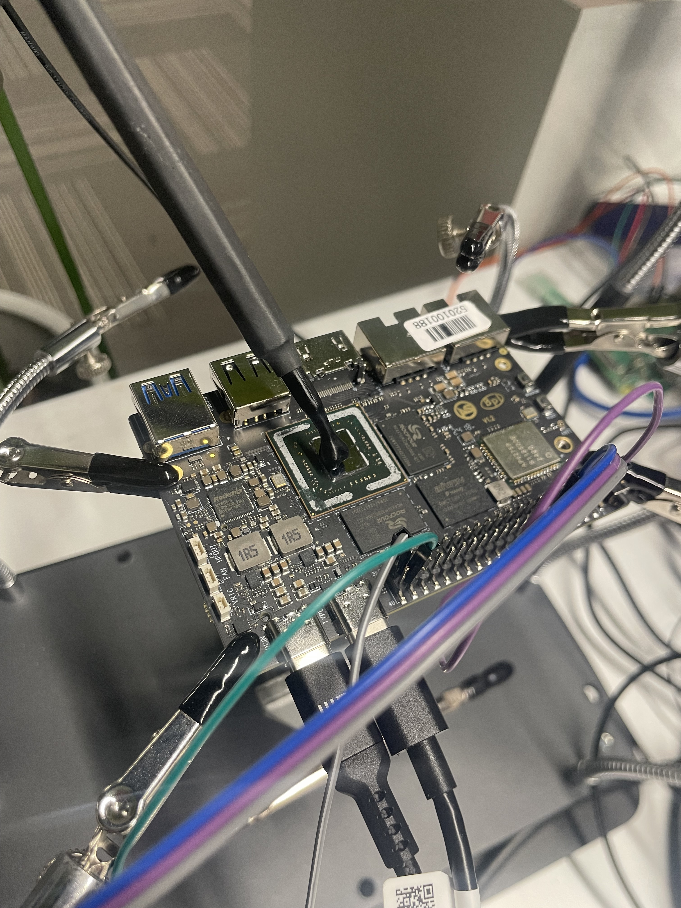
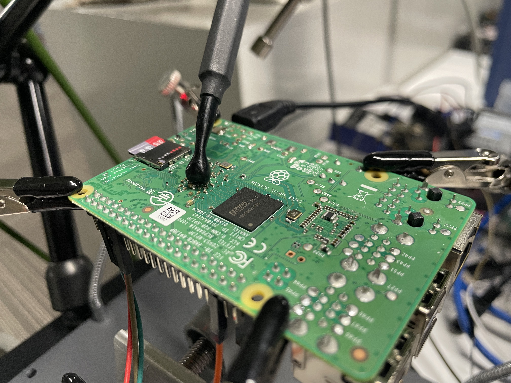

# Locating Cryptographic Procedures in SoC Secure Boot by Semi-automated Side-Channel Analysis

## Trace collection

### RK3588

When collecting the electromagnetic sideband trace from a Banana Pi BPI-M7 development board, you need to remove the metal protective cover of its CPU, as shown in the figure below:

### RPI3B+

Even after removing the metal protective cover, the front-side CPU leak of the Raspberry Pi 3b+ is very insignificant, so you need to probe the coupling capacitances from the back.

## Trace processing

The collected trace files used in the paper is too big to share on github. However, sharing files with other services may interfere with double-blind review, so we have decided to share the traces after the paper results are available. You can email us if you want to obtain the traces before then.

For the processing code, please refer to the trace_processing folder.